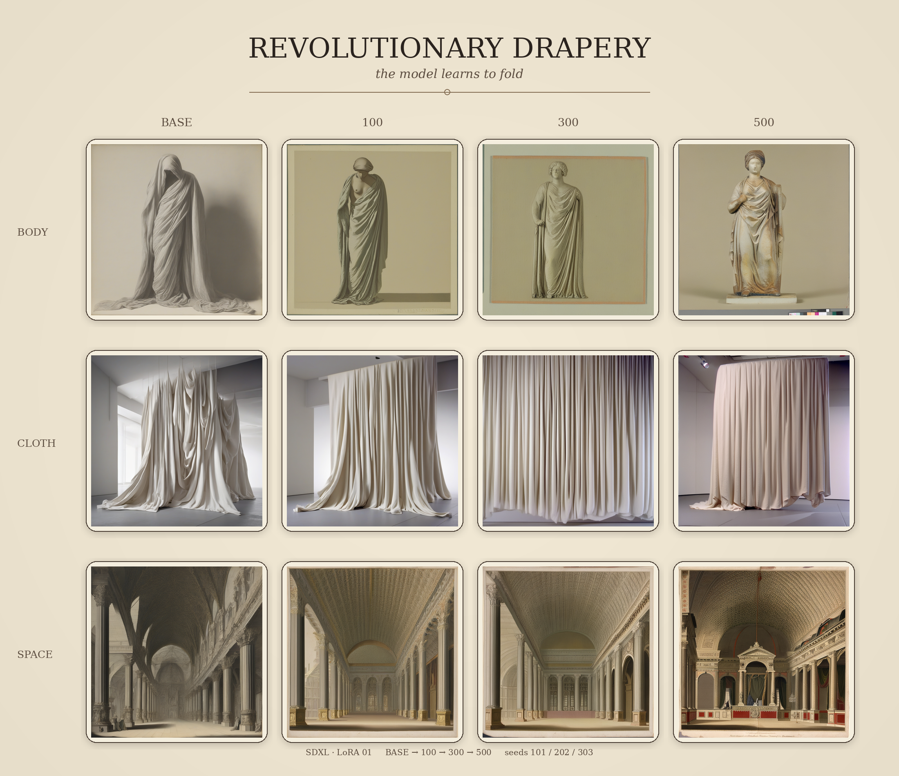

# Revolutionary Drapery: The Model Learns to Fold

_A controlled LoRA checkpoint study, 2026._

## Catalogue note

A controlled checkpoint study tracing how a LoRA trained on twenty public-domain works from The Met alters SDXL's interpretation of three prompts: body, cloth and space.

Identical prompts and seeds are regenerated at BASE, 100, 300 and 500 training steps. Rather than showing a simple progression toward improvement, the sequence reveals different forms of adaptation: the body becomes increasingly compact, unconstrained cloth begins to degrade, while architectural space acquires colour and material richness.

The study treats these changes not as a search for the "best" image, but as evidence of which visual regularities the model learns from a deliberately curated corpus.

## Method

Three fixed probes were used throughout the comparison:

- **BODY · seed 101**  
  `a standing figure wrapped in flowing drapery, fabric gathered around the body`

- **CLOTH · seed 202**  
  `loose cloth suspended in space, deep cascading folds and overlapping volumes`

- **SPACE · seed 303**  
  `an architectural interior enclosed by elaborate hanging drapery`

Each probe was generated using the same SDXL base model and generation settings at four stages:

**BASE → 100 → 300 → 500**

The BASE images were regenerated in the same runtime and on the same GPU as the checkpoint images, allowing the sequence to function as a controlled comparison of LoRA influence across training.

## Reading the checkpoints

The comparison does not suggest a single optimum training duration across all prompts.

In **BODY**, increasing LoRA influence progressively compacts the figure and its drapery. By 500 steps, the result appears more synthetic and less fluid than the BASE image.

In **CLOTH**, the BASE image is already highly synthetic, but retains a coherent representation of suspended fabric. The image begins to deviate more noticeably at 300 steps and deteriorates further at 500. As the prompt provides little semantic structure beyond cloth itself, it appears particularly susceptible to the learned visual regularities of the corpus.

In **SPACE**, the trajectory is markedly different. The BASE begins with a comparatively sketch-like architectural interpretation, while later checkpoints introduce stronger colour, material richness and a more pronounced historical-interior character. Here, the later adaptation produces the most generatively interesting result.

Taken together, the probes suggest that training duration is not simply a quality dial. Increasing LoRA influence can enrich one semantic context while constraining or degrading another.

## Curatorial observation

The corpus was assembled around a curatorial proposition: cloth making form through **wrapping, concealing, gathering, falling, suspending and enclosing**.

The model, however, has no access to that proposition as an organising concept. Alongside drapery morphology, the dataset contains other recurring visual regularities: pale historical objects, terracotta and stone surfaces, museum photography, isolated objects, drawings, garments and modes of display.

The checkpoint study therefore exposes a productive distinction between **the relationship intended by the curator** and **the statistical relationships available to the model**.

What the LoRA learns is not necessarily what the curator meant.

That divergence is part of the experiment.
